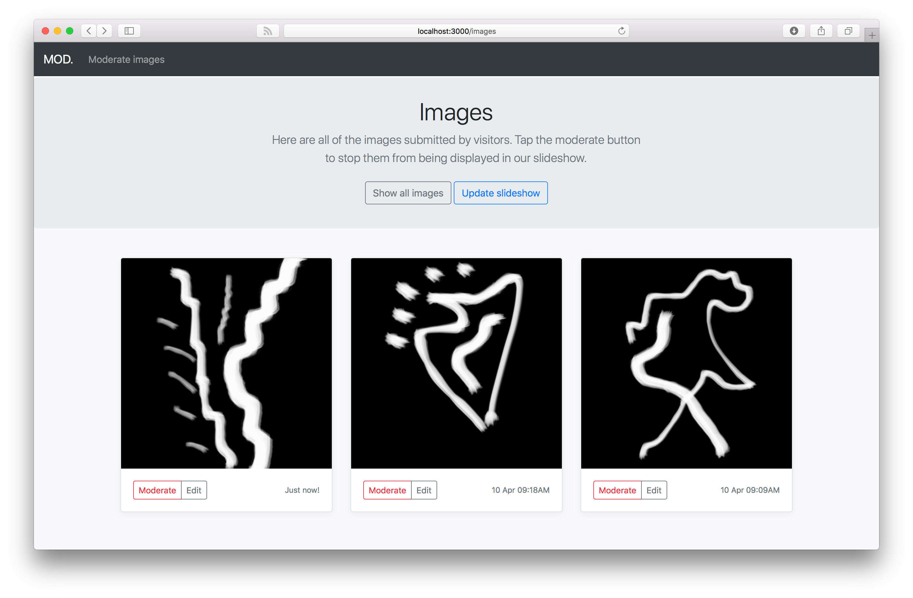

# MOD. image slideshow server

An image slideshow server written in [Ruby on Rails](https://rubyonrails.org). 



## TODO:

* ~~Create Image model~~.
* ~~Create POST API for accepting images~~.
* ~~Fix Action Cable to update homepage with new images created.~~
* ~~Create slideshow on homepage of 30 most recent images.~~
* ~~Make homepage slideshow fullscreen & fit the images to it.~~

## Run the server

```$ bundle install```
```$ rake db:create```
```$ rake db:migrate```
```$ rails s -b 0.0.0.0```

Create a ```config/application.yml``` file adding:

```Ruby
app_site_title: "MOD. Draw Your Pain"
projector_width: "1920"
projector_height: "1200"
deep_dream_server: "http://localhost:5000"
image_text_overlay_font_path: "/path/to/font.ttf"
```

## License

Released under an [MIT License](LICENSE).

Copyright (c) 2017 [MOD.](https://mod.org.au)
